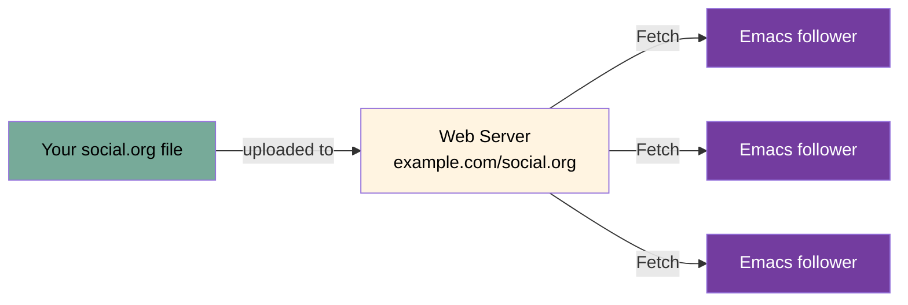
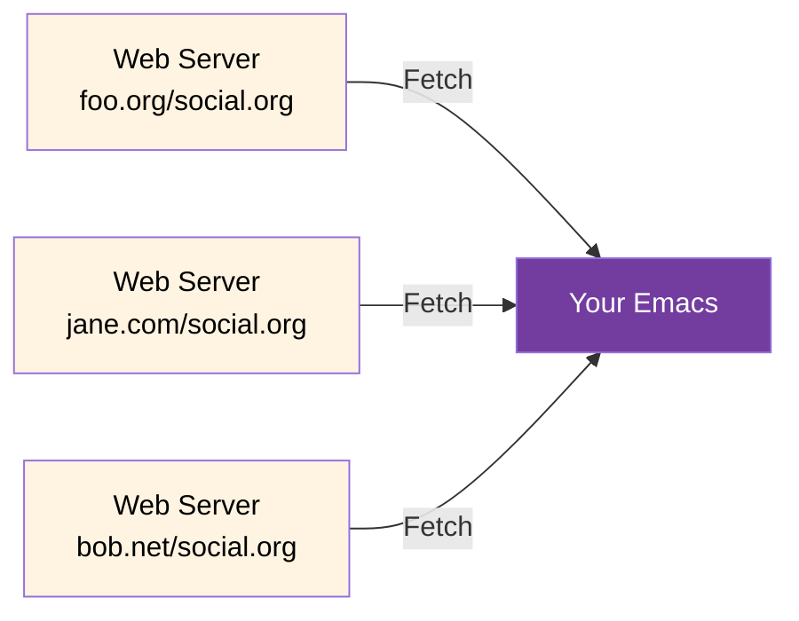
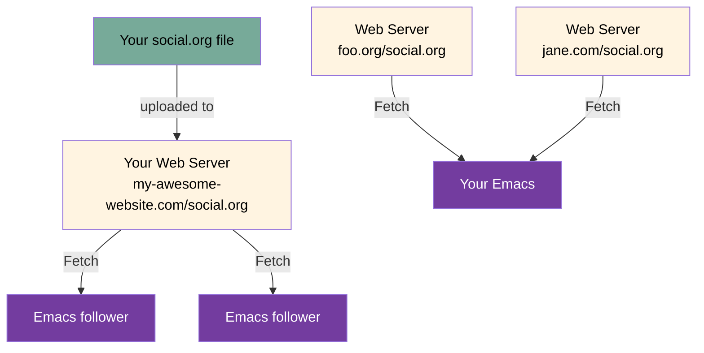
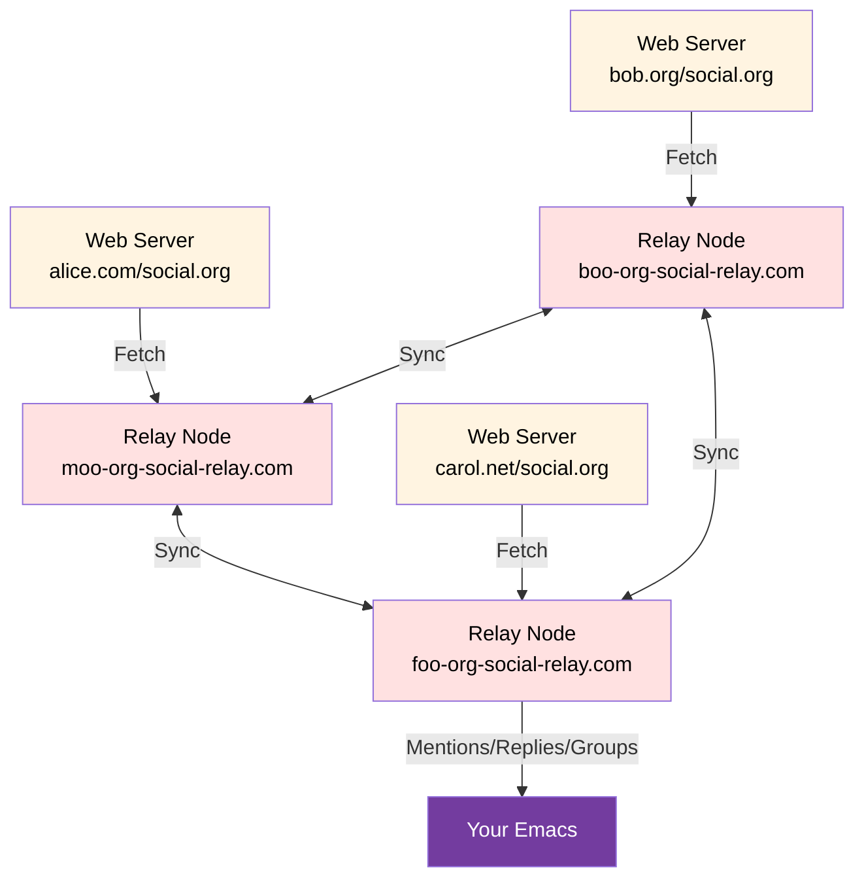

# Org Social


Org Social is a **decentralized social network** that runs on an **Org Mode** file over HTTP.



On "Orgverse", you can create posts, interact with groups, make replies, mention other users, create polls, or personalize your profile. All this without registration, without databases... Just you and your Org Mode file.

- [Official client](https://github.com/tanrax/org-social.el)
- [Other clients and libraries](https://github.com/tanrax/awesome-org-social/)

Explore the syntax and join the community!

- [Quickstart](#quickstart)
    - [Basic: read-only](#-basic-read-only)
    - [You write, reply and read](#%EF%B8%8F-you-write-reply-and-read)
- [Introduction](#introduction)
- [Tutorial](#tutorial)
- [Syntax](#syntax)
- [Discoverability](#discoverability)
- [FAQ](#faq)
- [Use cases](#use-cases)
	- [Make a new post](#make-a-new-post)
	- [Reply to a post](#reply-to-a-post)
	- [Make a poll](#make-a-poll)
	- [Vote on a poll](#vote-on-a-poll)
	- [Mention a user](#mention-a-user)
	- [Follow a user](#follow-a-user)
	- [Subscribe to a group](#subscribe-to-a-group)
	- [React to a post with emoji](#react-to-a-post-with-emoji)
	- [Create a multiline post with rich formatting](#create-a-multiline-post-with-rich-formatting)
- [Org Social Relay](#org-social-relay)
- [Community](#community)
- [Changelogs](#changelogs)

## Quickstart

You decide how much you want to interact with the community:

### 👀 Basic: read-only



Create a file called `social.org` and add the followers you want to read to your list.

```sh
M-x find-file RET social.org RET
```

Edit the file and add your basic information:

```org
#+TITLE: Bob's journal
```

Who to follow? You can start with:

```sh
curl https://org-social-relay.andros.dev/feeds/
```

You will find a list of active feeds. Add the ones you want to follow with the `#+FOLLOW:` keyword.

```org
#+TITLE: Bob's journal
#+FOLLOW: http://foo.org/social.org
#+FOLLOW: https://jane.com/social.org
```

Now you can read your friends' posts using your favorite [Org Social client](https://github.com/tanrax/awesome-org-social/).

### ✍️ You write, reply and read



Create a file called `social.org` and add your basic information and your first post.

```org
#+TITLE: Bob's journal
#+NICK: Bob
#+DESCRIPTION: I'm a software developer and I love open source.
#+AVATAR: https://my-awesome-website.com/avatar.jpg
#+LINK: https://my-awesome-website.com
#+FOLLOW: http://foo.org/social.org
#+FOLLOW: https://jane.com/social.org

* Posts
**
:PROPERTIES:
:ID: 2024-12-12T12:00:00+0100
:END:

Hello Org Social!
```

Upload the file to a web server and share the URL with your friends (`https://my-awesome-website.com/social.org`). Don't have your own hosting? [Check this section](#where-can-i-host-my-socialorg-file).

Simple. Now you can share your URL with your friends so they can follow you.

Optional: Do you want strangers to discover you? You can register your URL on a Relay.

Run this command:

```sh
curl -X POST https://org-social-relay.andros.dev/feeds/ -d '{"feed": "https://my-awesome-website.com/social.org"}' -H "Content-Type: application/json"
```

(Replace `https://my-awesome-website.com/social.org` with your actual URL.) You needs to do it only once.

Now it's your turn to learn how to interact with Org Social's syntax and the community. Check the [Use cases](#use-cases) section or use a Org Social client.

## Introduction

Org Social is a decentralized social network that leverages the simplicity and power of Org Mode files.

It allows users to create, share, and interact with posts in a human-readable format while maintaining compatibility with various text editors and tools. You can publish posts, interact with groups, make replies, mention other users, create polls or personalize your profile.

It is heavily inspired by [twtxt](https://twtxt.readthedocs.io/en/stable/), [Texudus](https://texudus.com), and the extensions developed by the [Yarn community](https://twtxt.dev/). It takes the best of these specifications, eliminates complex parts, leverages Org Mode's native features, and keeps the premise that social networking should be simple, accessible to both humans and machines, and manageable with standard text editing tools.

The values are:

1. **Simplicity**: Org Social is a simple text file that you can edit with any Emacs or text editor.
2. **Accessibility**: The feed can be read by humans and machines.
3. **Decentralization**: You are a node in the network. The feed is hosted on a web server and can be accessed by anyone.
4. **Org Philosophy**: Native Org Mode features are used to enhance the social experience, such as timestamps, properties, and links.

## Tutorial

### 1. Create an Org Mode file called `social.org`

```sh
M-x find-file RET social.org RET
```

### 2. Edit the file and add your basic information

```org
#+TITLE: My journal
#+NICK: YourNick
#+DESCRIPTION: A brief description about yourself
```

### 3. Add your first post

The format uses Org Mode headlines with timestamps. Each new post must be added under the `* Posts` section.

```org
* Posts
```

Now you can add your first post.

```org
**
:PROPERTIES:
:ID: 2025-04-28T12:00:00+0100
:END:

This is my first post on Org Social.
```

The header `**` indicates a new post. The `:PROPERTIES:` drawer is used to add metadata to the post, such as the unique identifier (`ID`) and other optional properties.

**Note:** It is recommended to leave a space after `**` (e.g., `** `) to improve navigation and readability when viewing the `social.org` file, though this is optional.

The datetime in the `ID` property is the unique identifier of each post. It must be in a subset of the *RFC 3339 format*. matching any of the forms:

* `####-##-##T##:##:##+##:##` e.g. `2025-12-30T20:30:15+00:00`, `2025-12-30T22:30:15+02:00`
* `####-##-##T##:##:##-####` (not including `:`) e.g. `2025-12-30T18:30:15-0200`

The result will be:

```org
#+TITLE: My journal
#+NICK: YourNick
#+DESCRIPTION: A brief description about yourself

* Posts
**
:PROPERTIES:
:ID: 2025-04-28T12:00:00+0100
:END:

This is my first post on Org Social.
```

The file must be encoded with UTF-8 and should use LF (`\n`) as line separators.

### 4. Upload the file to a web server

You can use any web server, but make sure it supports plain text files. You can use GitHub Pages, Gitea, or any other service that allows you to host plain text files.

To consume and read other users' feeds, you can read them manually, use a script, or a client.

## Syntax

### Comments

Every line that starts with a hash sign (`#`) outside of Org Mode syntax is considered a comment. However, prefer using Org Mode's native comment syntax:

```org
# This is an Org Mode comment
# This one too

#+BEGIN_COMMENT
This is a comment block
that can span multiple lines
#+END_COMMENT
```

### Global Metadata

Global metadata is defined using Org Mode's standard keywords at the top of the file:

```org
#+TITLE: My Awesome journal
#+NICK: Bob
#+DESCRIPTION: I love Emacs.
#+AVATAR: https://example.com/avatar.jpg
#+LINK: https://my-awesome-website.com
#+LINK: https://my-blog.com
#+FOLLOW: myBestFriend https://jane.com/social.org
#+FOLLOW: https://lucy.com/social.org
#+GROUP: Emacs https://example-relay.com
#+GROUP: Org Mode https://example-relay.com
#+CONTACT: mailto:my-email@example.com
#+CONTACT: xmpp:my@account.com
#+CONTACT: https://mastodon.social/@my-account
```

| Field | Description | Multiple | Required |
|-------|-------------|----------|----------|
| `TITLE` | The title of your social feed | ❌ | ✅ |
| `NICK` | Your nickname. This is the name that will be displayed in posts. You cannot use spaces. | ❌ | ✅ |
| `DESCRIPTION` | A short description about yourself | ❌ | ❌ |
| `AVATAR` | The URL of your avatar image. Square image with at least 128x128 pixels in JPG or PNG format. | ❌ | ❌ |
| `LINK` | Links to your personal website or profile | ✅ | ❌ |
| `FOLLOW` | Users you follow. Format: <nickname to remember (Optional)> <feed url> `https://example.com/social.org` or `myBestFriend https://example.com/social.org`. Not to be confused with the user-defined nickname. | ✅ | ❌ |
| `GROUP` | Group you wish to subscribe to. Format: <group name> <relay url> `Emacs https://example-relay.com` | ✅ | ❌ |
| `CONTACT` | Contact information: Email, XMPP, Matrix, ActivityPub, etc. | ✅ | ❌ |

### Post Metadata

Each post uses Org Mode's properties drawer for metadata:

```org
**
:PROPERTIES:
:ID: 2025-05-01T12:00:00+0100
:LANG: en
:TAGS: emacs org-social
:CLIENT: org-social.el
:REPLY_TO: http://foo.org/social.org#2025-02-03T23:05:00+0100
:GROUP: Emacs https://example-relay.com
:MOOD: 😊
:END:

This is the content of my post with some metadata.
```

Available properties:

| Property | Description | Example | Required |
|----------|-------------|----------| ---------|
| `ID` | Unique timestamp identifier (RFC 3339 format) | `2025-05-01T12:00:00+0100` | ✅ |
| `LANG` | Language code of the post | `en`, `es`, `fr` | ❌ |
| `TAGS` | Space-separated tags | `emacs org-social` | ❌ |
| `CLIENT` | Client application used | `org-social.el` | ❌ |
| `REPLY_TO` | ID of post being replied to. Format: `URL` + `#` +`ID` | `http://foo.org/social.org#2025-02-03T23:05:00+0100` | ❌ |
| `POLL_END` | End time for polls (RFC 3339 format) | `2025-05-01T13:00:00+0100` | ❌ |
| `POLL_OPTION` | Selected option in a poll vote | `Emacs Lisp` | ❌ |
| `GROUP` | Group the post belongs to. Format: <group name> <relay url> | `Emacs https://example-relay.com` | ❌ |
| `MOOD` | Mood indicator | `😊`, `❤`, `🚀` | ❌ |

**No property is multiple**.

### Mentions

Org Social uses Org Mode's link system for mentions. First, you can define a custom link type:

```org
[[org-social:http://example.org/social.org][username]]
```

Then mention users using this format:

```org
**
:PROPERTIES:
:ID: 2025-05-01T12:00:00+0100
:END:

Welcome to Org Social [[org-social:http://example.org/social.org][bob]]!
```

You can mention multiple users in a single post:

```org
**
:PROPERTIES:
:ID: 2025-05-01T12:00:00+0100
:END:

Good morning [[org-social:http://example.org/social.org][bob]] and [[org-social:http://alice.com/social.org][alice]]! What are you doing today?
```

### Multiline Posts

Org Mode naturally supports multiline content. Unlike plain text formats, you can write posts with multiple paragraphs, lists, and rich formatting:

```org
** <2025-05-01 Thu 12:00> A rich post
:PROPERTIES:
:ID: 2025-05-01T12:00:00+0100
:END:

This is a multiline post with rich content.

I can include:
- Lists with multiple items
- *Bold text* and /italic text/
- Code snippets: ~print("hello")~
- Links: [[https://example.com][Example website]]

#+BEGIN_SRC python
def parse_org_social(file_path):
	"""Parse an Org Social file"""
	with open(file_path, 'r') as f:
		content = f.read()
	# Implementation here
	return content
#+END_SRC

And much more!
```

### Polls

Polls use Org Mode's checkbox lists with special properties:

```org
**
:PROPERTIES:
:ID: 2025-05-01T12:00:00+0100
:POLL_END: 2025-05-01T13:00:00+0100
:END:

What's your favorite programming language?

Choose your favorite:

- [ ] Python
- [ ] JavaScript
- [ ] PHP
- [ ] Emacs Lisp
```

To vote on a poll, create a vote post:

```org
**
:PROPERTIES:
:ID: 2025-05-01T13:00:00+0100
:REPLY_TO: http://example.org/social.org#2025-05-01T12:00:00+0100
:POLL_OPTION: Emacs Lisp
:END:

I choose Emacs Lisp as my favorite programming language!
```

### Media Attachments

Reference media files using Org Mode's link syntax. You can link to images, videos, or any other media:

```org
**
:PROPERTIES:
:ID: 2025-05-01T12:00:00+0100
:END:

I want to share [[https://www.gnu.org/software/emacs/manual/pdf/emacs.pdf][Emacs Manual PDF]] with everyone.
```

## Discoverability

Because of the decentralised nature it is very difficult to discover new users. You have to think of it as a technology similar to email or RSS feeds. The natural flow to find new addresses, URLs, or nodes, is because you have been given the address or because you have seen a link on a website. Org Social is the same. You have to share your address with your friends or on social media. The more you interact with the community, the more Org social files you can discover.

However, you have an alternative solution. You can register your feed in a public [Org Social Relay](https://github.com/tanrax/org-social?tab=readme-ov-file#org-social-relay) Node.

For example:

```sh
curl -X POST https://org-social-relay.andros.dev/feeds/ -d '{"feed": "https://example.com/social.org"}' -H "Content-Type: application/json"
```

This will share your feed with other public nodes and make it easier for others to discover you.

## FAQ

### Can I use it as a simple substitute for RSS/Atom?

Yes, check this example:

```org
#+TITLE: Bob's Blog Feed
#+NICK: Bob_feed
#+DESCRIPTION: This is my blog feed.
#+AVATAR: https://blog.example.com/avatar.jpg

* Posts
**
:PROPERTIES:
:ID: 2025-05-01T12:00:00+0100
:TITLE: My awesome title
:LANG: en
:CATEGORY: programming
:URL: https://blog.example.com/my-awesome-article
:END:

This is my awesome article content!
```

### Is there pagination?

Yes. You can use the HTTP header `Content-Range` with `Content-Length` to paginate the feed. Check the [HTTP Range Requests](https://developer.mozilla.org/en-US/docs/Web/HTTP/Range_requests) documentation and [this](https://en.andros.dev/blog/4e12225f/why-your-socialorg-files-can-have-millions-of-lines-without-any-performance-issues/) article.

### Where can I host my `social.org` file?

You can use any web server that supports plain text files.

- Static hosting services: Tiiny Host, Static.run, Netlify, Vercel, Cloudflare Pages, etc.
- Repositories: GitHub Pages, Gitea, or any other service that allows you to host plain text files.
- Self-hosted: [Nginx](https://www.nginx.com/), [Apache](https://httpd.apache.org/) or [Caddy](https://caddyserver.com/).
- Clouds: Dropbox, Google Drive, OneDrive, etc, but make sure they support direct links to plain text files.

### How often do I need to check the followers' feeds?

It depends on how you use it. Check the header `Last-Modified` to see if the feed has changed. If the feed has changed, you can fetch the new feed.

### Can I modify a post after I publish it or delete it?

Yes, you can modify or delete a post after you publish it. Just edit the file and upload it again keeping the original timestamp unchanged (otherwise you are making a new post and will break replies to your post). Clients will fetch the new file and update your profile.

### Is there a official client?

Yes, [org-social.el](https://github.com/tanrax/org-social.el). Check [Awesome Org Social](https://github.com/tanrax/awesome-org-social/) for more clients and libraries.

### Can I make private posts or restrict who sees my content?

No. Org Social files are public by design. Anyone with the URL can read your feed. If you need privacy:

- Use a private server with authentication (HTTP Basic Auth, IP whitelist, etc.)
- Share your feed URL only with trusted people
- Don't publish sensitive information

### Is there a size limit for the social.org file?

No, none. Write whatever you need.

### Can I change my feed URL after publishing it?

The best strategy is to set up a permanent redirect (301) from the old URL to the new one.

The other option is to notify each of your followers and add your new URL to a public Relay (it will automatically notify the rest, and your old URL will eventually be deleted when it receives a 404 error).

## Use cases

### Make a new post

You can make a new post by adding a new headline under the `* Posts` section. Use the `:ID:` property to set the unique identifier for the post.

```org
* Posts
**
:PROPERTIES:
:ID: 2025-05-01T12:00:00+0100
:END:

This is my new post on Org-social.
```

The other properties are optional.

If you want it to be published in a group, use the `:GROUP:` property.

```org
* Posts
**
:PROPERTIES:
:ID: 2025-05-01T12:00:00+0100
:GROUP: Emacs https://example-relay.com
:END:

This is my new post on Org-social in the emacs group.
```

### Reply to a post

To reply to a post, create a new headline with the `:REPLY_TO:` property set to the ID of the post you are replying to. This will create a link back to the original post.

The format is: `receiver URL` + `#` + `ID of the post being replied to`.

```org
**
:PROPERTIES:
:ID: 2025-05-01T12:30:00+0100
:REPLY_TO: http://example-receiver.com/social.org#2025-05-01T12:00:00+0100
:END:

I agree with your point about the new feature. It will be very useful for many users.
```

If you just want to leave a reaction on a post: ❤, ⭐, 🚀, 👍... You can use `:MOOD:` with the emoji and leave the body blank.

```org
**
:PROPERTIES:
:ID: 2025-05-01T12:30:00+0100
:REPLY_TO: http://example-receiver.com/social.org#2025-05-01T12:00:00+0100
:MOOD: ❤
:END:

```

### Make a poll

To create a poll, use the `:POLL_END:` property to set the end time of the poll. Use a checkbox list to define the options.

```org
**
:PROPERTIES:
:ID: 2025-05-01T12:00:00+0100
:POLL_END: 2025-05-01T13:00:00+0100
:END:

Do you have a pet?

- [ ] Cat
- [ ] Dog
- [ ] Fish
- [ ] Bird
```

### Vote on a poll

To vote on a poll, create a new post with the `:REPLY_TO:` property set to the ID of the poll post. Use the `:POLL_OPTION:` property to indicate your choice.

```org
**
:PROPERTIES:
:ID: 2025-05-01T12:30:00+0100
:REPLY_TO: http://example-poll.com/social.org#2025-05-01T12:00:00+0100
:POLL_OPTION: Cat
:END:

Meow!
```

The content of the post can be anything you want, but it is recommended to keep it short and to the point.

### Mention a user

To mention a user, use the custom link format defined in the `LINK` property. This will create a link to the user's profile.

The format is `[[org-social:URL of the user's social.org][nickname]]`

```org
**
:PROPERTIES:
:ID: 2025-05-01T12:00:00+0100
:END:

Hello [[org-social:http://example-user.com/social.org][Alice]], how are you?
```

### Follow a user

To follow a user, add the `#+FOLLOW:` keyword at the top of your file with the URL of their `social.org` file. You can optionally include a nickname to remember them by.

```org
#+TITLE: Bob's journal
#+NICK: Bob
#+FOLLOW: https://alice.com/social.org
#+FOLLOW: myBestFriend https://jane.com/social.org
```

### Subscribe to a group

To subscribe to a group, add the `#+GROUP:` keyword at the top of your file with the group name and relay URL. This allows you to see posts from that group.

**Note:** You will need a [Relay-compatible client](https://github.com/tanrax/awesome-org-social/) and access to an [Org Social Relay](#org-social-relay) to use this feature.

```org
#+TITLE: Bob's journal
#+NICK: Bob
#+GROUP: Emacs https://example-relay.com
#+GROUP: Org Mode https://example-relay.com
```

### React to a post with emoji

To react to a post with an emoji (❤, ⭐, 🚀, 👍, etc.), create a reply with the `:MOOD:` property and leave the body blank.

```org
**
:PROPERTIES:
:ID: 2025-05-01T12:30:00+0100
:REPLY_TO: http://example-receiver.com/social.org#2025-05-01T12:00:00+0100
:MOOD: ❤
:END:

```

### Create a multiline post with rich formatting

Org Mode supports rich content including multiple paragraphs, lists, bold/italic text, code blocks, tables with calculations, and links.

```org
**
:PROPERTIES:
:ID: 2025-05-01T12:00:00+0100
:END:

This is a multiline post with rich content.

I can include:
- Lists with multiple items
- *Bold text* and /italic text/
- Code snippets: ~print("hello")~
- Links: [[https://example.com][Example website]]

#+BEGIN_SRC python
def hello_world():
    print("Hello from Org Social!")
#+END_SRC

| Item    | Price | Quantity | Total |
|---------+-------+----------+-------|
| Coffee  |  2.50 |        3 |  7.50 |
| Tea     |  1.80 |        2 |  3.60 |
| Cookies |  3.00 |        1 |  3.00 |
|---------+-------+----------+-------|
| Total   |       |          | 14.10 |
#+TBLFM: @2$4=$2*$3::@3$4=$2*$3::@4$4=$2*$3::@5$4=vsum(@2..@4)

And much more!
```

## Org Social Relay

Due to the decentralised nature of Org Social, it is not possible to receive mentions, replies or read threads from users you do not follow. Unless you use *Org Social Relay*.

*Org Social Relay* is a P2P system that acts as an intermediary between all Org Social files. It scans the network, creating an index of users, mentions, replies, groups and threads.



This allows you to:

- Receive mentions and replies.
- Have a more comprehensive notification system.
- Read or participate in threads.
- Perform searches (tags and full text).
- Participate in groups.

First, you will need a [Relay-compatible client](https://github.com/tanrax/awesome-org-social/).

Then you can set up your own instance of [Social Org Relay](https://github.com/tanrax/org-social-relay). Your node will automatically connect to other active Relay nodes and work with them to remove load from the network and share information. The more Relay nodes there are, the better the experience will be for everyone. It is currently an alpha technology that only allows participation by invitation. When the project is more mature, it will be open to everyone.

Otherwise, you can use a [public Relay node](/org-social-relay-list.txt).

## Community

- Org Social Group: `Org Social` on `https://org-social-relay.andros.dev`.
- IRC channel: `#org-social` on Libera.Chat

## Changelogs

## 1.3

- Added `:MOOD:` property to express reactions to posts.
- Added `:GROUP:` property to subscribe to groups and publish posts in groups.

### 1.2

- Avatar image must be at least 128x128 pixels in JPG or PNG format.

## 1.1

- Removed the separation between `* Posts` and the first header 2 `**`.

Before

```org
* Posts

**
```

After

```org
* Posts
**
```

- Removed `:REPLY_URL:` property.

Thanks [@confusedalex](https://github.com/confusedalex).

## 1.0

First draft

## Thanks

Thanks to all the people who have contributed to this project by reporting issues, making suggestions, or simply using it. ❤
