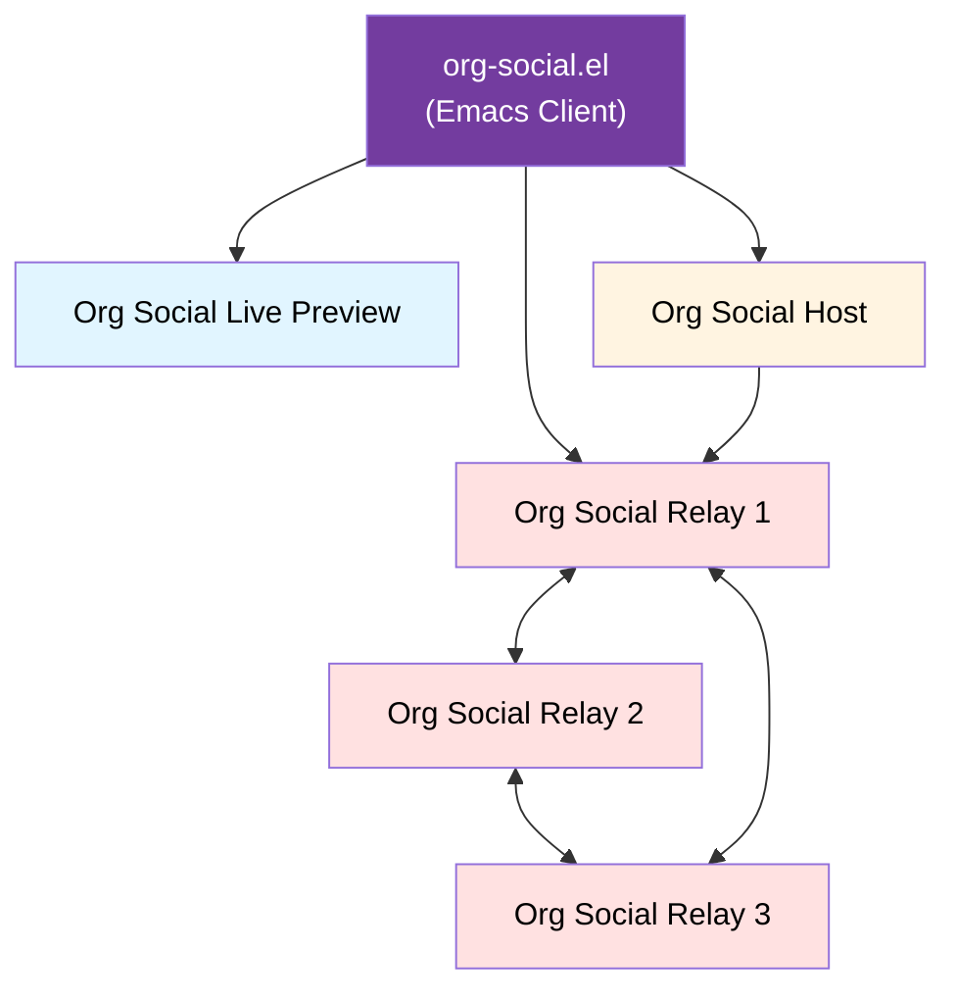

# Org Social


Org Social is a **decentralized social network** that runs on an **Org Mode** file over HTTP.

The values are:

1. **✏️ Simplicity**: Org Social is a simple text file that you can edit with any Emacs or text editor.
2. **🌐 Accessibility**: The feed can be read by humans and machines.
3. **🕸️ Decentralization**: You are a node in the network. The feed is hosted on a web server and can be accessed by anyone.
4. **🦄 Org Philosophy**: Native Org Mode features are used to enhance the social experience, such as tables, code blocks, and links.
5. **🔐 Your information belongs to you**: Your posts and interactions with the community are recorded in your Org file.

Upload your file and let the community read it or interact with you.


You can create **posts**, interact with **groups**, make **replies**, mention other users, create **polls**, or personalize your **profile**. All this **without registration**, without databases... Just you and **your Org Mode file**.

You can use it as:

- **Microblogging**: publish short messages and interact with the community through replies or reactions.
- **Blog system**: Share all your articles using Org Mode syntax with no limits on length or quantity. In addition, each reply will be a comment. And if you want, you can generate an HTML version using org-mode exporters or static site generators.
- **Forum**: Create or participate in groups and discuss topics with other users.
- **RSS/Atom alternative**: Share your articles in a simple and decentralized way.

Review current clients:

- [Official client](https://github.com/tanrax/org-social.el)
- [Other clients and libraries](https://github.com/tanrax/awesome-org-social/)

And explore the syntax and join the community!

- [Quick and easy start](#quick-and-easy-start)
- [Quickstart for Nerds](#quickstart-for-nerds)
    - [Basic: read-only](#-basic-read-only)
    - [You write, reply and read](#%EF%B8%8F-you-write-reply-and-read)
- [Introduction](#introduction)
- [Tutorial](#tutorial)
- [Syntax](#syntax)
- [Discoverability](#discoverability)
- [FAQ](#faq)
- [Use cases](#use-cases)
	- [Make a new post](#make-a-new-post)
	- [Reply to a post](#reply-to-a-post)
	- [Boost a post](#boost-a-post)
	- [Make a poll](#make-a-poll)
	- [Vote on a poll](#vote-on-a-poll)
	- [Mention a user](#mention-a-user)
	- [Create a mention-only post](#create-a-mention-only-post)
	- [Follow a user](#follow-a-user)
	- [Subscribe to a group](#subscribe-to-a-group)
	- [Pin a post to your profile](#pin-a-post-to-your-profile)
	- [React to a post with emoji](#react-to-a-post-with-emoji)
	- [Create a multiline post with rich formatting](#create-a-multiline-post-with-rich-formatting)
	- [Migrate your account to a new URL](#migrate-your-account-to-a-new-url)
	- [Schedule a post](#schedule-a-post)
	- [Add a title to a post](#add-a-title-to-a-post)
	- [Share your RSS feed](#share-your-rss-feed)
	- [Share an HTML preview of a post](#share-an-html-preview-of-a-post)
- [Org Social Relay](#org-social-relay)
- [Architecture](#architecture)
- [Other Cool Things You Can Do](#other-cool-things-you-can-do)
- [Community](#community)
- [CHANGELOG.md](CHANGELOG.md)

## Quick and easy start

Are you new to Org Social? Follow this quick tutorial to get started without needing to know all the technical details:

[Quick Tutorial to Get Started on Org Social](https://en.andros.dev/blog/ddd78757/quick-tutorial-to-get-started-on-org-social/)

This guide will walk you through the basics in a simple, step-by-step way.

## Quickstart for Nerds

You decide how much you want to interact with the community:

### 👀 Basic: read-only


Create a file called `social.org` and add the followers you want to read to your list.

```sh
M-x find-file RET social.org RET
```

Edit the file and add your basic information:

```org
#+TITLE: Bob's journal
```

Who to follow? You can start with:

```sh
curl https://relay.org-social.org/feeds/
```

You will find a list of active feeds. Add the ones you want to follow with the `#+FOLLOW:` keyword.

```org
#+TITLE: Bob's journal
#+FOLLOW: https://foo.org/social.org
#+FOLLOW: https://jane.com/social.org
```

Now you can read your friends' posts. We recommend the [official client](https://github.com/tanrax/org-social.el) for Emacs users, or check [other clients](https://github.com/tanrax/awesome-org-social/).

### ✍️ You write, reply and read


Create a file called `social.org` and add your basic information and your first post.

```org
#+TITLE: Bob's journal
#+NICK: Bob
#+DESCRIPTION: I'm a software developer and I love open source.
#+AVATAR: https://my-awesome-website.com/avatar.jpg
#+LINK: https://my-awesome-website.com
#+FOLLOW: https://foo.org/social.org
#+FOLLOW: https://jane.com/social.org

* Posts
**
:PROPERTIES:
:ID: 2024-12-12T12:00:00+0100
:END:

Hello Org Social!
```

Upload the file to a web server and share the URL with your friends (`https://my-awesome-website.com/social.org`). Don't have your own hosting? [Check this section](#where-can-i-host-my-socialorg-file).

Simple. Now you can share your URL with your friends so they can follow you.

Optional: Do you want strangers to discover you? You can register your URL on a Relay.

Run this command:

```sh
curl -X POST https://relay.org-social.org/feeds/ -d '{"feed": "https://my-awesome-website.com/social.org"}' -H "Content-Type: application/json"
```

(Replace `https://my-awesome-website.com/social.org` with your actual URL.) You need to do it only once.

Now it's your turn to learn how to interact with Org Social's syntax and the community. Check the [Use cases](#use-cases) section or install the [official client](https://github.com/tanrax/org-social.el).

## Introduction

Org Social is a decentralized social network that leverages the simplicity and power of Org Mode files.

It allows users to create, share, and interact with posts in a human-readable format while maintaining compatibility with various text editors and tools. You can publish posts, interact with groups, make replies, mention other users, create polls or personalize your profile.

It is heavily inspired by [twtxt](https://twtxt.readthedocs.io/en/stable/), [Texudus](https://texudus.com), and the extensions developed by the [Yarn community](https://twtxt.dev/). It takes the best of these specifications, eliminates complex parts, leverages Org Mode's native features, and keeps the premise that social networking should be simple, accessible to both humans and machines, and manageable with standard text editing tools.

## Tutorial

### 1. Create an Org Mode file called `social.org`

```sh
M-x find-file RET social.org RET
```

### 2. Edit the file and add your basic information

```org
#+TITLE: My journal
#+NICK: YourNick
#+DESCRIPTION: A brief description about yourself
```

### 3. Add your first post

The format uses Org Mode headlines with timestamps. Each new post must be added under the `* Posts` section.

```org
* Posts
```

Now you can add your first post.

```org
** 2025-04-28T12:00:00+0100
:PROPERTIES:
:END:

This is my first post on Org Social.
```

The header `**` indicates a new post. The timestamp after `**` is the unique identifier (ID) of the post. The `:PROPERTIES:` drawer can contain additional optional metadata.

**Note:** The ID can also be placed inside the properties drawer as `:ID: 2025-04-28T12:00:00+0100` instead of in the header. Both formats are valid.

The datetime ID must be in a subset of the *RFC 3339 format*, matching any of the forms:

* `####-##-##T##:##:##+##:##` e.g. `2025-12-30T20:30:15+00:00`, `2025-12-30T22:30:15+02:00`
* `####-##-##T##:##:##-####` (not including `:`) e.g. `2025-12-30T18:30:15-0200`

The result will be:

```org
#+TITLE: My journal
#+NICK: YourNick
#+DESCRIPTION: A brief description about yourself

* Posts
** 2025-04-28T12:00:00+0100
:PROPERTIES:
:END:

This is my first post on Org Social.
```

The file must be encoded with UTF-8 and should use LF (`\n`) as line separators.

### 4. Upload the file to a web server

You can use any web server, but make sure it supports plain text files. You can use GitHub Pages, Gitea, or any other service that allows you to host plain text files.

### 5. Install a client to read and interact

To consume and read other users' feeds, install the [official client](https://github.com/tanrax/org-social.el) for Emacs, or check [other available clients](https://github.com/tanrax/awesome-org-social/).

## Syntax

### Comments

Every line that starts with a hash sign (`#`) outside of Org Mode syntax is considered a comment. However, prefer using Org Mode's native comment syntax:

```org
# This is an Org Mode comment
# This one too

#+BEGIN_COMMENT
This is a comment block
that can span multiple lines
#+END_COMMENT
```

### Global Metadata

Global metadata is defined using Org Mode's standard keywords at the top of the file:

```org
#+TITLE: My Awesome journal
#+NICK: Bob
#+DESCRIPTION: I love Emacs.
#+AVATAR: https://example.com/avatar.jpg
#+LINK: https://my-awesome-website.com
#+LINK: https://my-blog.com
#+LOCATION: Valencia, Spain
#+BIRTHDAY: 1990-05-15
#+LANGUAGE: en es ca
#+FOLLOW: myBestFriend https://jane.com/social.org
#+FOLLOW: https://lucy.com/social.org
#+GROUP: Emacs https://example-relay.com
#+GROUP: Org Mode https://example-relay.com
#+CONTACT: mailto:my-email@example.com
#+CONTACT: xmpp:my@account.com
#+CONTACT: https://mastodon.social/@my-account
#+PINNED: 2025-04-28T12:00:00+0100
```

| Field | Description | Multiple | Required |
|-------|-------------|----------|----------|
| `TITLE` | The title of your social feed | ❌ | ✅ |
| `NICK` | Your nickname. This is the name that will be displayed in posts. You cannot use spaces. | ❌ | ✅ |
| `DESCRIPTION` | A short description about yourself | ❌ | ❌ |
| `AVATAR` | The URL of your avatar image. Square image with at least 128x128 pixels in JPG or PNG format. | ❌ | ❌ |
| `LINK` | Links to your personal website or profile | ✅ | ❌ |
| `LOCATION` | Your location (city, country, or any text describing where you are) | ❌ | ❌ |
| `BIRTHDAY` | Your birthday in YYYY-MM-DD format | ❌ | ❌ |
| `LANGUAGE` | Space-separated language codes (ISO 639-1) that you speak | ❌ | ❌ |
| `FOLLOW` | Users you follow. Format: <nickname to remember (Optional)> <feed url> `https://example.com/social.org` or `myBestFriend https://example.com/social.org`. Not to be confused with the user-defined nickname. | ✅ | ❌ |
| `GROUP` | Group you wish to subscribe to. Format: <group name> <relay url> `Emacs https://example-relay.com` | ✅ | ❌ |
| `CONTACT` | Contact information: Email, XMPP, Matrix, ActivityPub, etc. | ✅ | ❌ |
| `PINNED` | Post ID (timestamp) of the post pinned to the top of your profile | ❌ | ❌ |

### Post Metadata

Each post uses Org Mode's properties drawer for metadata. The post ID (timestamp) can be specified in two ways:

1. **In the header** (after `**`): `** 2025-05-01T12:00:00+0100`
2. **In the properties drawer**: `:ID: 2025-05-01T12:00:00+0100`

Both formats are valid. If the ID appears in both places, the header value takes priority.

**Example with ID in header:**

```org
** 2025-05-01T12:00:00+0100
:PROPERTIES:
:LANG: en
:TAGS: emacs org-social
:CLIENT: org-social.el
:REPLY_TO: https://foo.org/social.org#2025-02-03T23:05:00+0100
:GROUP: Emacs https://example-relay.com
:VISIBILITY: mention
:MOOD: 😊
:END:

This is the content of my post with the ID in the header.
```

**Example with ID in properties (traditional format):**

```org
**
:PROPERTIES:
:ID: 2025-05-01T12:00:00+0100
:LANG: en
:TAGS: emacs org-social
:CLIENT: org-social.el
:REPLY_TO: https://foo.org/social.org#2025-02-03T23:05:00+0100
:GROUP: Emacs https://example-relay.com
:VISIBILITY: mention
:MOOD: 😊
:END:

This is the content of my post with the ID in properties.
```

Available properties:

| Property | Description | Example |
|----------|-------------|----------|
| `ID` | Unique timestamp identifier (RFC 3339 format). **Required**. Can be specified in the post header (after `**`) or in the properties drawer. If both are present, the header value takes priority. Posts with future dates are considered scheduled posts and should not be displayed by clients until the scheduled time. | `2025-05-01T12:00:00+0100` |
| `LANG` | Language code of the post | `en`, `es`, `fr` |
| `TAGS` | Space-separated tags | `emacs org-social` |
| `CLIENT` | Client application used | `org-social.el` |
| `REPLY_TO` | ID of post being replied to. Format: `URL` + `#` +`ID` | `https://foo.org/social.org#2025-02-03T23:05:00+0100` |
| `POLL_END` | End time for polls (RFC 3339 format) | `2025-05-01T13:00:00+0100` |
| `POLL_OPTION` | Selected option in a poll vote | `Emacs Lisp` |
| `GROUP` | Group the post belongs to. Format: <group name> <relay url> | `Emacs https://example-relay.com` |
| `MOOD` | Mood indicator | `😊`, `❤`, `🚀` |
| `INCLUDE` | Post being boosted/shared. Format: `URL` + `#` +`ID` | `https://alice.com/social.org#2025-05-01T10:00:00+0100` |
| `MIGRATION` | Indicates account migration from old to new URL. Format: `<old-url> <new-url>` | `https://old-address.com/social.org https://new-address.com/social.org` |
| `VISIBILITY` | Controls post visibility. Values: `public` (default if not specified) or `mention`. When set to `mention`, the post should only be displayed to mentioned users. Client extracts mentioned users from org-social links in the post body. Does not apply to posts with `GROUP` property. | `public`, `mention` |

**Notes:**
- Only `ID` is required. All other properties are optional.
- No property is multiple.

### Mentions

Org Social uses Org Mode's link system for mentions. First, you can define a custom link type:

```org
[[org-social:https://example.org/social.org][username]]
```

Then mention users using this format:

```org
**
:PROPERTIES:
:ID: 2025-05-01T12:00:00+0100
:END:

Welcome to Org Social [[org-social:https://example.org/social.org][bob]]!
```

You can mention multiple users in a single post:

```org
**
:PROPERTIES:
:ID: 2025-05-01T12:00:00+0100
:END:

Good morning [[org-social:https://example.org/social.org][bob]] and [[org-social:https://alice.com/social.org][alice]]! What are you doing today?
```

### Visibility

By default, all posts are public. However, you can control post visibility using the `:VISIBILITY:` property to create mention-only posts that should only be displayed to mentioned users.

When you set `:VISIBILITY: mention`, clients should:
1. Parse the post body to extract all `[[org-social:URL][name]]` links
2. Only display the post to the extracted mentioned users and the post author
3. Optionally display the post to users who have already participated in the thread

**Important:** This is a UI display suggestion for clients, not a security or privacy feature. Org Social files are public by design. Anyone with access to your `social.org` URL can read all posts regardless of visibility settings. For true privacy, use HTTP authentication on your web server.

Example of a mention-only post:

```org
**
:PROPERTIES:
:ID: 2025-05-01T12:00:00+0100
:VISIBILITY: mention
:END:

Hey [[org-social:https://bob.com/social.org][bob]] and [[org-social:https://carol.net/social.org][carol]], what do you think about the new feature?
```

In this example, clients should only display this post to:
- The post author
- `https://bob.com/social.org`
- `https://carol.net/social.org`

**Visibility and Groups:** The `:VISIBILITY:` property does not apply to posts with the `:GROUP:` property. Group posts are always visible to all group members.

```org
**
:PROPERTIES:
:ID: 2025-05-01T12:00:00+0100
:GROUP: Emacs https://example-relay.com
:VISIBILITY: mention
:END:

This post is in a group, so VISIBILITY is ignored and the post is visible to all group members.
```

**Visibility in Threads:** Each post declares its own visibility independently. There is no inheritance of visibility from parent to child posts. When displaying threads, clients should show posts according to each post's individual visibility setting while maintaining thread context.

### Multiline Posts

Org Mode naturally supports multiline content. Unlike plain text formats, you can write posts with multiple paragraphs, lists, and rich formatting:

```org
** <2025-05-01 Thu 12:00> A rich post
:PROPERTIES:
:ID: 2025-05-01T12:00:00+0100
:END:

This is a multiline post with rich content.

I can include:
- Lists with multiple items
- *Bold text* and /italic text/
- Code snippets: ~print("hello")~
- Links: [[https://example.com][Example website]]

#+BEGIN_SRC python
def parse_org_social(file_path):
	"""Parse an Org Social file"""
	with open(file_path, 'r') as f:
		content = f.read()
	# Implementation here
	return content
#+END_SRC

And much more!
```

### Polls

Polls use Org Mode's checkbox lists with special properties:

```org
**
:PROPERTIES:
:ID: 2025-05-01T12:00:00+0100
:POLL_END: 2025-05-01T13:00:00+0100
:END:

What's your favorite programming language?

Choose your favorite:

- [ ] Python
- [ ] JavaScript
- [ ] PHP
- [ ] Emacs Lisp
```

To vote on a poll, create a vote post:

```org
**
:PROPERTIES:
:ID: 2025-05-01T13:00:00+0100
:REPLY_TO: https://example.org/social.org#2025-05-01T12:00:00+0100
:POLL_OPTION: Emacs Lisp
:END:

I choose Emacs Lisp as my favorite programming language!
```

### Media Attachments

Reference media files using Org Mode's link syntax. You can link to images, videos, or any other media:

```org
**
:PROPERTIES:
:ID: 2025-05-01T12:00:00+0100
:END:

I want to share [[https://www.gnu.org/software/emacs/manual/pdf/emacs.pdf][Emacs Manual PDF]] with everyone.
```

## Discoverability

Because of the decentralised nature it is very difficult to discover new users. You have to think of it as a technology similar to email or RSS feeds. The natural flow to find new addresses, URLs, or nodes, is because you have been given the address or because you have seen a link on a website. Org Social is the same. You have to share your address with your friends or on social media. The more you interact with the community, the more Org social files you can discover.

However, Org Social has a network of nodes, Relays, which are responsible for reading the feeds, synchronizing them, and discovering each `social.org` to other users.

If you use the Emacs client, it will register you automatically. Otherwise, you can do it with a single command:

```sh
curl -X POST https://relay.org-social.org/feeds/ -d '{"feed": "https://example.com/social.org"}' -H "Content-Type: application/json"
```

In a couple of hours, your feed will be visible to all Relays. When someone enters the "Discover" section within their client, they will be able to follow you.

## FAQ

### Can I use it as a simple substitute for RSS/Atom?

Yes, check this example:

```org
#+TITLE: Bob's Blog Feed
#+NICK: Bob_feed
#+DESCRIPTION: This is my blog feed.
#+AVATAR: https://blog.example.com/avatar.jpg

* Posts
**
:PROPERTIES:
:ID: 2025-05-01T12:00:00+0100
:LANG: en
:CATEGORY: programming
:URL: https://blog.example.com/my-awesome-article
:END:

This is my awesome article content!
```

### Is there pagination?

Yes. You can use the HTTP header `Content-Range` with `Content-Length` to paginate the feed. Check the [HTTP Range Requests](https://developer.mozilla.org/en-US/docs/Web/HTTP/Range_requests) documentation and [this](https://en.andros.dev/blog/4e12225f/why-your-socialorg-files-can-have-millions-of-lines-without-any-performance-issues/) article.

### Where can I host my `social.org` file?

You can use any web server that supports plain text files.

- Org Social Host: Free service that also allows you to sync remotely.
- Static hosting services: Tiiny Host, Static.run, Netlify, Vercel, Cloudflare Pages, etc.
- Repositories: GitHub Pages, Gitea, or any other service that allows you to host plain text files.
- Self-hosted: [Nginx](https://www.nginx.com/), [Apache](https://httpd.apache.org/) or [Caddy](https://caddyserver.com/).
- Clouds: Dropbox, Google Drive, OneDrive, etc, but make sure they support direct links to plain text files.

### How often do I need to check the followers' feeds?

It depends on how you use it. Check the header `Last-Modified` to see if the feed has changed. If the feed has changed, you can fetch the new feed.

### Can I modify a post after I publish it or delete it?

Yes, you can modify or delete a post after you publish it. Just edit the file and upload it again keeping the original timestamp unchanged (otherwise you are making a new post and will break replies to your post). Clients will fetch the new file and update your profile.

### Is there a official client?

Yes, [org-social.el](https://github.com/tanrax/org-social.el). Check [Awesome Org Social](https://github.com/tanrax/awesome-org-social/) for more clients and libraries.

### Can I make private posts or restrict who sees my content?

No. Org Social files are public by design. Anyone with the URL can read your feed. If you need privacy:

- Use a private server with authentication (HTTP Basic Auth, IP whitelist, etc.)
- Share your feed URL only with trusted people
- Don't publish sensitive information

### Is there a size limit for the social.org file?

No, none. Write whatever you need.

### Can I change my feed URL after publishing it?

The best strategy is to set up a permanent redirect (301) from the old URL to the new one.

The other option is to notify each of your followers and add your new URL to a public Relay (it will automatically notify the rest, and your old URL will eventually be deleted when it receives a 404 error).

### Why are the headers `**` sometimes empty and sometimes have a timestamp?

The header after `**` can contain the post ID (timestamp) or be empty:

- `** 2025-05-01T12:00:00+0100` - ID in the header (more visible when navigating the file)
- `** ` - Empty header, ID in properties drawer (traditional format)

Both formats are valid. When the ID is in the header, it's easier to see when browsing the file in org-mode. When it's in the properties drawer, the headers remain visually uniform.

**Why not use this space for a title?**

- The context of Org Social posts is similar to Mastodon or X/Twitter, where posts don't typically have titles
- It improves readability - there's no need to distinguish between titles and content
- Within a post, you can have any hierarchy of titles you want using `***`, `****`, etc.
- From a technical standpoint, it's simpler to implement and maintain

## Use cases

### Make a new post

You can make a new post by adding a new headline under the `* Posts` section. The post ID (timestamp) can be specified in the header or in the properties drawer.

**Option 1: ID in the header (after `**`)**

```org
* Posts
** 2025-05-01T12:00:00+0100
:PROPERTIES:
:END:

This is my new post on Org-social with ID in the header.
```

**Option 2: ID in properties drawer (traditional)**

```org
* Posts
**
:PROPERTIES:
:ID: 2025-05-01T12:00:00+0100
:END:

This is my new post on Org-social with ID in properties.
```

Both formats are valid. The other properties are optional.

If you want it to be published in a group, use the `:GROUP:` property.

```org
* Posts
**
:PROPERTIES:
:ID: 2025-05-01T12:00:00+0100
:GROUP: Emacs https://example-relay.com
:END:

This is my new post on Org-social in the emacs group.
```

### Reply to a post

To reply to a post, create a new headline with the `:REPLY_TO:` property set to the ID of the post you are replying to. This will create a link back to the original post.

The format is: `receiver URL` + `#` + `ID of the post being replied to`.

```org
** 2025-05-01T12:30:00+0100
:PROPERTIES:
:REPLY_TO: https://example-receiver.com/social.org#2025-05-01T12:00:00+0100
:END:

I agree with your point about the new feature. It will be very useful for many users.
```

If you just want to leave a reaction on a post: ❤, ⭐, 🚀, 👍... You can use `:MOOD:` with the emoji and leave the body blank.

```org
** 2025-05-01T12:30:00+0100
:PROPERTIES:
:REPLY_TO: https://example-receiver.com/social.org#2025-05-01T12:00:00+0100
:MOOD: ❤
:END:

```

### Boost a post

To share someone else's post on your timeline (boost/retweet), use the `:INCLUDE:` property. Perfect for sharing another user's content with your followers and helping to spread the word about accounts.

The format is: `feed URL` + `#` + `ID of the post being boosted`.

**Simple boost (no comment)**

```org
** 2025-05-01T14:00:00+0100
:PROPERTIES:
:INCLUDE: https://alice.com/social.org#2025-05-01T10:00:00+0100
:END:

```

**Quote boost (with comment)**

```org
** 2025-05-01T14:00:00+0100
:PROPERTIES:
:INCLUDE: https://alice.com/social.org#2025-05-01T10:00:00+0100
:END:

Guys, you have to see this!
```

### Make a poll

To create a poll, use the `:POLL_END:` property to set the end time of the poll. Use a checkbox list to define the options.

```org
** 2025-05-01T12:00:00+0100
:PROPERTIES:
:POLL_END: 2025-05-01T13:00:00+0100
:END:

Do you have a pet?

- [ ] Cat
- [ ] Dog
- [ ] Fish
- [ ] Bird
```

### Vote on a poll

To vote on a poll, create a new post with the `:REPLY_TO:` property set to the ID of the poll post. Use the `:POLL_OPTION:` property to indicate your choice.

```org
** 2025-05-01T12:30:00+0100
:PROPERTIES:
:REPLY_TO: https://example-poll.com/social.org#2025-05-01T12:00:00+0100
:POLL_OPTION: Cat
:END:

Meow!
```

The content of the post can be anything you want, but it is recommended to keep it short and to the point.

### Mention a user

To mention a user, use the custom link format defined in the `LINK` property. This will create a link to the user's profile.

The format is `[[org-social:URL of the user's social.org][nickname]]`

```org
** 2025-05-01T12:00:00+0100
:PROPERTIES:
:END:

Hello [[org-social:https://example-user.com/social.org][Alice]], how are you?
```

### Create a mention-only post

To create a post that should only be visible to mentioned users, use the `:VISIBILITY: mention` property. The client will automatically extract mentioned users from the post body and only display the post to them.

```org
** 2025-05-01T14:00:00+0100
:PROPERTIES:
:VISIBILITY: mention
:END:

Hey [[org-social:https://bob.com/social.org][Bob]] and [[org-social:https://carol.net/social.org][Carol]], I wanted to discuss the project privately with you both.
```

This post will only be displayed to:
- The author
- `https://bob.com/social.org`
- `https://carol.net/social.org`

**Important notes:**
- This is a UI display preference for clients, not a security feature
- The post remains publicly accessible in your `social.org` file
- For true privacy, use HTTP authentication on your web server
- Does not work with posts that have the `:GROUP:` property

You can also reply to a mention-only post while maintaining visibility:

```org
** 2025-05-01T15:00:00+0100
:PROPERTIES:
:REPLY_TO: https://alice.com/social.org#2025-05-01T14:00:00+0100
:VISIBILITY: mention
:END:

[[org-social:https://alice.com/social.org][Alice]], I agree with your points. [[org-social:https://carol.net/social.org][Carol]] what do you think?
```

### Follow a user

To follow a user, add the `#+FOLLOW:` keyword at the top of your file with the URL of their `social.org` file. You can optionally include a nickname to remember them by.

```org
#+TITLE: Bob's journal
#+NICK: Bob
#+FOLLOW: https://alice.com/social.org
#+FOLLOW: myBestFriend https://jane.com/social.org
```

### Subscribe to a group

To subscribe to a group, add the `#+GROUP:` keyword at the top of your file with the group name and relay URL. This allows you to see posts from that group.

**Note:** You will need a [Relay-compatible client](https://github.com/tanrax/awesome-org-social/) and access to an [Org Social Relay](#org-social-relay) to use this feature.

```org
#+TITLE: Bob's journal
#+NICK: Bob
#+GROUP: Emacs https://example-relay.com
#+GROUP: Org Mode https://example-relay.com
```

### Pin a post to your profile

To pin a post to the top of your profile, add the `#+PINNED:` keyword at the top of your file with the ID (timestamp) of the post you want to pin.

First, identify the post you want to pin by finding its ID. The ID is the timestamp in the post header or in the `:ID:` property:

```org
* Posts
** 2025-04-28T12:00:00+0100
:PROPERTIES:
:END:

This is my most important post that I want everyone to see!
```

Then, add the `#+PINNED:` field in your global metadata with that ID:

```org
#+TITLE: Bob's journal
#+NICK: Bob
#+PINNED: 2025-04-28T12:00:00+0100
```

The pinned post will appear at the top of your profile when clients display it. You can only pin one post at a time - if you update the `#+PINNED:` value, the new post will become the pinned one.

**Note:** Clients that support pinned posts will display it prominently at the top of your profile, similar to pinned tweets on Twitter or pinned posts on Mastodon.

### React to a post with emoji

To react to a post with an emoji (❤, ⭐, 🚀, 👍, etc.), create a reply with the `:MOOD:` property and leave the body blank.

```org
** 2025-05-01T12:30:00+0100
:PROPERTIES:
:REPLY_TO: https://example-receiver.com/social.org#2025-05-01T12:00:00+0100
:MOOD: ❤
:END:

```

### Create a multiline post with rich formatting

Org Mode supports rich content including multiple paragraphs, lists, bold/italic text, code blocks, tables with calculations, and links.

```org
** 2025-05-01T12:00:00+0100
:PROPERTIES:
:END:

This is a multiline post with rich content.

I can include:
- Lists with multiple items
- *Bold text* and /italic text/
- Code snippets: ~print("hello")~
- Links: [[https://example.com][Example website]]

#+BEGIN_SRC python
def hello_world():
    print("Hello from Org Social!")
#+END_SRC

| Item    | Price | Quantity | Total |
|---------+-------+----------+-------|
| Coffee  |  2.50 |        3 |  7.50 |
| Tea     |  1.80 |        2 |  3.60 |
| Cookies |  3.00 |        1 |  3.00 |
|---------+-------+----------+-------|
| Total   |       |          | 14.10 |
#+TBLFM: @2$4=$2*$3::@3$4=$2*$3::@4$4=$2*$3::@5$4=vsum(@2..@4)

And much more!
```

### Schedule a post

Posts with a future date in their ID (whether in the header or properties) are considered scheduled posts. These posts will not be displayed by clients until their scheduled time arrives.

```org
** 40000-01-01T00:00:00+0100
:PROPERTIES:
:END:

In the grim darkness of the far future, there is only war.
```

Clients should filter out posts where the ID timestamp is in the future. Once the scheduled time passes, the post will automatically become visible when clients fetch the feed.

### Add a title to a post

You don't need a special property to add a title to your post. Simply use Org Mode's native heading syntax with `***`:

```org
** 2025-05-01T12:00:00+0100
:PROPERTIES:
:END:

*** My First Blog Post

Today I want to share my thoughts about Org Mode and why it's such a powerful tool for organizing information.

I've been using it for years and it has completely changed how I work with text files.
```

The `***` creates a third-level heading that acts as your post title, while the content below is the body of your post. This keeps everything simple and follows Org Mode conventions.

### Share your RSS feed

First, register your feed on a Relay:

```bash
# Your social.org URL: https://my-awesome-website.com/social.org

curl -X POST https://relay.org-social.org/feeds/ -d '{"feed": "https://my-awesome-website.com/social.org"}' -H "Content-Type: application/json"
```

**Note:** If you use the [official client](https://github.com/tanrax/org-social.el), registration happens automatically—no manual step needed.

After registration, wait at least **1 minute** for your feed to be indexed. The Relay scans all registered feeds every minute.

Once indexed, your feed is automatically available as RSS. Anyone can subscribe using standard RSS readers.

The RSS URL format is:

```
https://relay.org-social.org/rss.xml?feed=<your-url-encoded-social.org-url>
```

Example:

```bash
# Your social.org URL: https://my-awesome-website.com/social.org

# Your RSS feed URL (URL-encoded)
https://relay.org-social.org/rss.xml?feed=https%3A%2F%2Fmy-awesome-website.com%2Fsocial.org
```

Share this RSS URL so others can follow you with their favorite RSS reader.

### Share an HTML preview of a post

Share individual posts on social media with rich previews using the public preview service:

```
https://preview.org-social.org/?post=<your-url-encoded-post-url>
```

Example:

```bash
# Your post URL (feed URL + # + post ID): https://my-awesome-website.com/social.org#2025-05-01T12:00:00+0100

# Preview URL (URL-encoded)
https://preview.org-social.org/?post=https%3A%2F%2Fmy-awesome-website.com%2Fsocial.org%232025-05-01T12%3A00%3A00%2B0100
```

The preview includes Open Graph metadata for rich social media sharing.

### Migrate your account to a new URL

If you need to move your `social.org` file to a new URL, you can create a migration post to notify your followers and allow clients to automatically update their follow lists.

Create a post with the `:MIGRATION:` property containing both your old and new URLs:

```org
** 2025-05-15T10:00:00+0100
:PROPERTIES:
:MIGRATION: https://old-address.com/social.org https://new-address.com/social.org
:END:

```

The post body is typically left empty, as the migration information is in the property. This special post serves two purposes:

1. **Notify your followers**: Informs them that you've moved to a new address
2. **Enable automatic client updates**: Compatible clients can automatically update their follow lists, replacing your old URL with the new one

After creating the migration post:

1. Upload it to your **old URL** so followers can discover the migration
2. Set up a permanent redirect (301) from your old URL to the new one
3. Continue posting from your **new URL**

Clients should detect migration posts and offer to update the followed URL automatically, ensuring your followers don't lose track of you.

## Org Social Relay

Due to the decentralised nature of Org Social, it is not possible to receive mentions, replies or read threads from users you do not follow. Unless you use *Org Social Relay*.

*Org Social Relay* is a P2P system that acts as an intermediary between all Org Social files. It scans the network, creating an index of users, mentions, replies, groups and threads.


This allows you to:

- Receive mentions and replies.
- Have a more comprehensive notification system.
- Read or participate in threads.
- Perform searches (tags and full text).
- Participate in groups.

First, you will need a [Relay-compatible client](https://github.com/tanrax/awesome-org-social/).

Then you can set up your own instance of [Social Org Relay](https://github.com/tanrax/org-social-relay). Your node will automatically connect to other active Relay nodes and work with them to remove load from the network and share information. The more Relay nodes there are, the better the experience will be for everyone. It is currently an alpha technology that only allows participation by invitation. When the project is more mature, it will be open to everyone.

Otherwise, you can use a [public Relay node](/org-social-relay-list.txt).

## Architecture

The Org Social ecosystem consists of several interconnected components that work together to provide a complete decentralized social networking experience:



- **org-social.el**: The official Emacs client for Org Social. It provides a full-featured interface for reading, writing, and interacting with Org Social feeds. It handles feed synchronization, post creation, reply management, and integration with the Relay system.

- **Org Social Relay** : A P2P system that acts as an intermediary between all Org Social files. It scans the network creating an index of users, mentions, replies, groups and threads. Multiple Relay nodes synchronize with each other to distribute the load and share information across the network.

- **Org Social Live Preview**: A real-time preview service that renders your posts. It helps you to make them viewable on other social networks or in the browser.

- **Org Social Host**: A free hosting service specifically designed for Org Social files. It provides a simple way to host your `social.org` file with remote synchronization capabilities. Hosted files are automatically registered with the Relay network for discoverability.

**Everything is optional!** All you need is your `social.org` and a web server. The rest are elements that will enrich your experience.

## Other Cool Things You Can Do

Beyond the standard social networking use cases, Org Social's simplicity and flexibility open up some creative possibilities:

- **Personal Blog System with RSS Feed**: Since the Relay generates **individual RSS feeds for each feed**, you can use Org Social as a lightweight blogging platform.
- **Private Forums and Discussion Spaces**: You can use Org Social to create **private forums** where everyone writes in Org Mode.
- **Decentralized Event Planning**: Use Org Social to organize events, share details, and manage RSVPs in a decentralized manner.
- **Public bookmark manager**: Use your `social.org` file to save and categorize bookmarks using Org Mode's native link and tagging features.

## Community

We have official accounts that you can follow right from the start:

- [Org Social official account](https://org-social.org/social.org)
- [Aggregates blogs about Emacs](https://planet-emacs.org-social.org/)
- [Aggregates blogs about Org Mode](https://org-mode.org-social.org/)

Or join the group:

- `Org Social` on `https://relay.org-social.org`.

Or IRC channel:

- `#org-social` on Libera.Chat

## Ecosystem Developers

### Active Contributors

These developers maintain alternative clients and tools for the Org Social ecosystem:

- **[AdsanTheGreat](https://github.com/AdsanTheGreat)** - Creator of [org-social-rs](https://github.com/AdsanTheGreat/org-social-rs), a CLI/TUI client written in Rust
  - Website: [adsan.dev](https://adsan.dev)
  - Org Social Feed: [adsan.dev/social.org](https://adsan.dev/social.org)

- **[cherryramatisdev](https://github.com/cherryramatisdev)** - Creator of [org-social.nvim](https://github.com/cherryramatisdev/org-social.nvim), a Neovim client
  - Website: [cherryramatis.xyz](https://cherryramatis.xyz)
  - Org Social Feed: [cherryramatis.xyz/social.org](https://cherryramatis.xyz/social.org)

### Community Contributors

These developers contribute to the Org Social ecosystem through integrations, tooling, feedback, and community support:

- **[johnhamelink](https://github.com/johnhamelink)**
  - Website: [johnhame.link](https://johnhame.link)
  - Org Social Feed: [johnhame.link/social.org](https://johnhame.link/social.org)

- **[tux0r (dertuxmalwieder)](https://github.com/dertuxmalwieder)**
  - Website: [rosaelefanten.org](https://rosaelefanten.org)
  - Org Social Feed: [rosaelefanten.org/social.org](https://rosaelefanten.org/social.org)

- **[TheSolarPrincess](https://github.com/TheSolarPrincess)**
  - Website: [thesolarprincess.site](https://thesolarprincess.site)
  - Org Social Feed: [thesolarprincess.site/social.org](https://thesolarprincess.site/social.org)

## Thanks

Thanks to all the people who have contributed to this project by reporting issues, making suggestions, or simply using it. ❤
